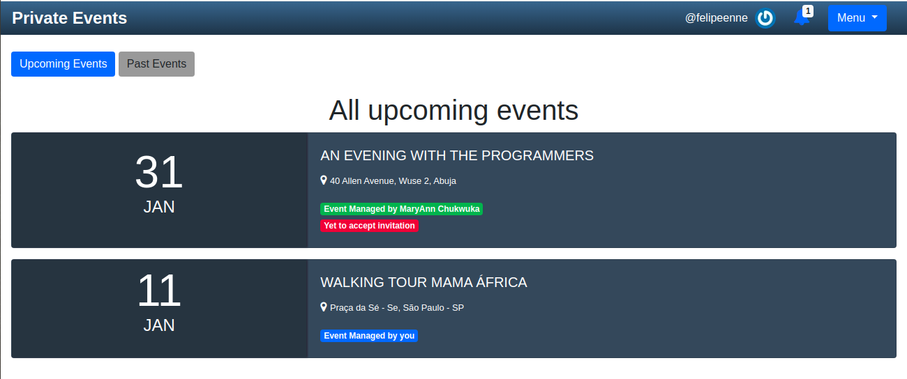

<!--
*** Thanks for checking out this README Template. 
-->


<!-- PROJECT TITLE -->

<br />
<h1 align="center">Private Events - Associations</h1>


<!-- TABLE OF CONTENTS -->


## Table of Contents

* [About the Project](#about-the-project)
  * [Built With](#built-with)
* [Required Installations](#required-installations)
* [Instalation of This App](#instalation)
* [License](#license)
* [Contact](#contact)
* [Acknowledgements](#acknowledgements)


<!-- ABOUT THE PROJECT -->
## About The Project

In this project, you will build an application named Private Events and that behaves similar to Eventbrite. The main goal is to put in practice the main concepts of Associations in rails.

Full task description: <a href="https://www.theodinproject.com/courses/ruby-on-rails/lessons/associations"> Odin Project.</a>


## Live Preview

Below is the link to the live preview in Heroku. Login in with the following created users usernames. 
* johndoe
* janebarker 
Feel free to test or just play around with the app features. <br>
<a href="https://afternoon-waters-36349.herokuapp.com">Private Events</a> <br><br>
<p>Below is the Event Page Screenshot</p>
<br>


### Built With 

* HTML
* CSS
* Git
* Ruby
* Ruby on Rails


## Required Installations

<p>If you want a copy of this project running on your machine you have to install:</p>

* Ruby 2.6.4
* Gem 3.0.3
* Rails 6.0.2
* Bundler 2.0.2

<a href="https://www.tutorialspoint.com/ruby-on-rails/rails-installation"> Installation Instructions</a>

<!-- INSTALATION -->
## Instalation of This App

Once you have installed the requiered packages shown on the [Required Installations](#required-installations), proceed with the following steps

Clone the Repository,

```Shell
your@pc:~$ git clone https://github.com/FelipeEnne/Private_Events
```

Move to the downloaded folder

```Shell
your@pc:~$ cd Private_Events
```

install gems

```Shell
your@pc:~$ bundle install --without production
```

migrate the database

```Shell
your@pc:~$ rails db:migrate
```

Run the app in a local server:

```Shell
your@pc:~$ rails server
```

Then, go to [http://localhost:3000](http://localhost:3000)

<!-- LICENSE -->
## License

Distributed under the MIT License. See `LICENSE` for more information.

<!-- CONTACT -->
## Contact
* Felipe Enne - felipeenne@gmail.com | [Github Account https://github.com/FelipeEnne](https://github.com/FelipeEnne)
* MaryAnn Chukwuka - annychuks07@gmail.com | [Github Account https://github.com/adaorachi](https://github.com/adaorachi)

<!-- ACKNOWLEDGEMENTS -->
## Acknowledgements

* <a href="https://www.microverse.org/"> Microverse</a>  and <a href="https://www.theodinproject.com/"> Odin Project</a> .